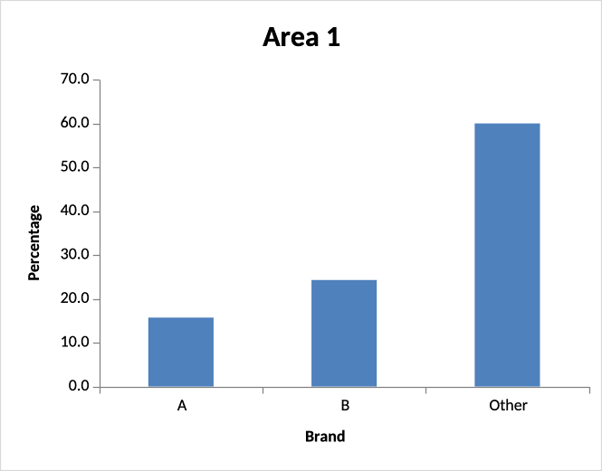
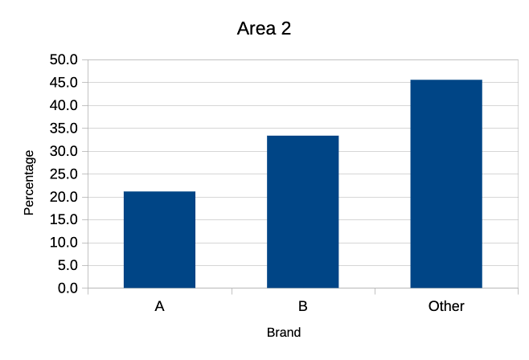
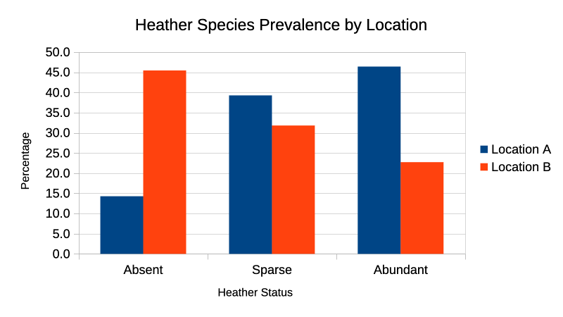
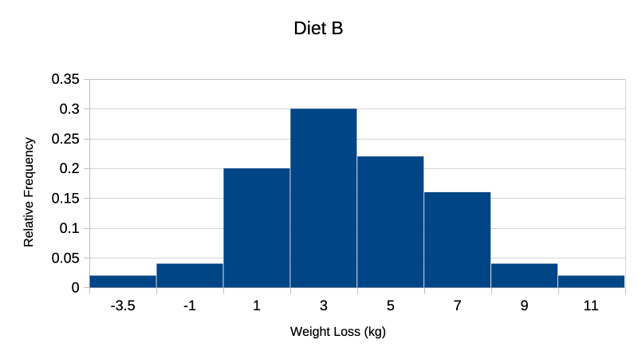

# Unit 9: Charts Worksheet Solutions

## Exercise 9.1: Brand Preference Bar Charts

**Task:** Add a percentage frequency bar chart showing the brand preferences in Area 2, alongside the Area 1 chart.

**Data:**
- **Area 1:** Brand A (15.7%), Brand B (24.3%), Other (60.0%)
- **Area 2:** Brand A (21.1%), Brand B (33.3%), Other (45.6%)

**Visual Comparison:**

  

    
  

  

    
  

**Solution Interpretation:**

Area 2 shows higher preference for both Brand A (21.1% vs 15.7%) and Brand B (33.3% vs 24.3%) compared to Area 1. Conversely, Area 1 has a higher percentage preferring "Other" brands (60.0% vs 45.6%). This indicates different brand preferences between the two demographic areas, with Area 2 consumers more likely to choose Brands A or B over alternative options.

**File:** [Exe_9.1D_Solution.xlsx](artefacts/Exe_9.1D_Solution-9.1.xlsx)

## Exercise 9.2: Clustered Column Chart - Heather Species Prevalence

**Task:** Create a percentage frequency clustered column chart showing heather species prevalence in two different locations.

**Data:**
- **Absent:** Location A (14.3%), Location B (45.5%)
- **Sparse:** Location A (39.3%), Location B (31.8%)
- **Abundant:** Location A (46.4%), Location B (22.7%)

**Visual Result:**

  

**Solution Interpretation:**

Location A shows predominantly abundant heather coverage (46.4%), while Location B has significantly more absent areas (45.5%). The pattern reverses across locations - Location A has increasing percentages from absent to abundant, while Location B shows the opposite trend. This suggests markedly different environmental conditions or land management practices between the two locations.

**File:** [Exe_9.2E_Solution-9.2.xlsx](artefacts/Exe_9.2E_Solution-9.2.xlsx)

## Exercise 9.3: Diet Histograms

**Task:** Add a relative frequency histogram for Diet B weight loss using the same classes as Diet A.

**Diet Statistics Comparison:**
- **Diet A:** Mean = 5.34, SD = 2.54, Min = -1.72, Max = 10.06, Range = 11.78
- **Diet B:** Mean = 3.71, SD = 2.77, Min = -4.148, Max = 10.539, Range = 14.687

**Diet B Results:**

| Class Mark | Frequency | Relative Frequency |
|------------|-----------|-------------------|
| -3.5       | 1         | 0.02              |
| -1         | 2         | 0.04              |
| 1          | 10        | 0.20              |
| 3          | 15        | 0.30              |
| 5          | 11        | 0.22              |
| 7          | 8         | 0.16              |
| 9          | 2         | 0.04              |
| 11         | 1         | 0.02              |
| **Total**  | **50**    | **1.00**          |

**Visual Result:**

  

**Solution Interpretation:**

Diet A shows higher average weight loss (5.34 kg vs 3.71 kg) with Diet B showing greater variability (SD 2.77 vs 2.54). Diet B has a wider range (14.687 vs 11.78) and includes negative weight loss values (minimum -4.148). Diet A demonstrates more consistent results with most values clustered around the higher mean, while Diet B shows a broader distribution with peak frequency in the 2-4 kg range but extends to both higher and lower extremes.

**File:** [Exe_9.3_Solution.xlsx](artefacts/Exe_9.3_Solution.xlsx)

---
[← Back to RMPP Module]({{ '/rmpp/' | relative_url }})